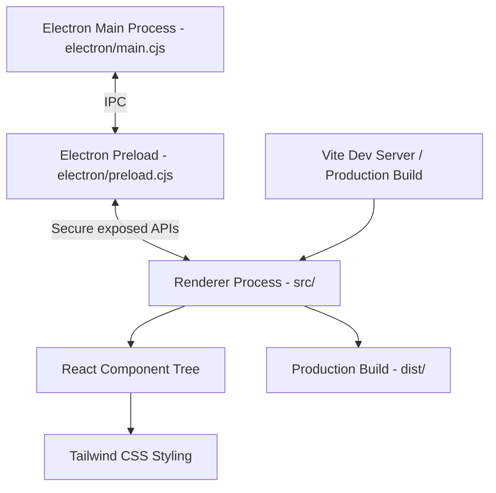

# Project Context & Architecture

This document summarizes the current state, architecture, configuration, and development workflow for the **Urdu-English Interpreter Desktop Application**.

---

## 🧭 Project Goal

Build a desktop application for **English-Urdu translation/interpreter functionality**. The current implementation is a modern desktop renderer built with **Electron**, **React**, **Vite**, **Tailwind CSS**, **TypeScript**, **Biome**, **Vitest**, and **Husky**.

---

## 🏗️ Architecture

The application is structured as an **Electron + Vite + React** desktop app.



### Core Layers

| Layer                 | Path                                       | Purpose                                                                         |
| --------------------- | ------------------------------------------ | ------------------------------------------------------------------------------- |
| Electron main process | `Desktop application/electron/main.cjs`    | Creates/manages the native desktop window and owns Electron lifecycle behavior. |
| Electron preload      | `Desktop application/electron/preload.cjs` | Provides a controlled bridge between Electron APIs and the renderer.            |
| Renderer process      | `Desktop application/src/`                 | React UI rendered inside the Electron window.                                   |
| Vite config           | `Desktop application/vite.config.ts`       | Builds/serves the renderer app.                                                 |
| Vitest config         | `Desktop application/vitest.config.ts`     | Configures the test runner and test environment.                                |
| TypeScript config     | `Desktop application/tsconfig.json`        | Defines strict TypeScript compiler settings.                                    |
| Biome config          | `Desktop application/biome.json`           | Defines formatting and linting rules.                                           |
| Husky hooks           | `Desktop application/.husky/`              | Runs checks automatically before Git commits.                                   |
| Package scripts       | `Desktop application/package.json`         | Defines development, build, lint, typecheck, and test commands.                 |

---

## 📁 Current File Layout

```text
Desktop application/
├── electron/
│   ├── main.cjs
│   └── preload.cjs
├── src/
│   ├── App.test.tsx
│   ├── App.tsx
│   ├── index.css
│   ├── main.tsx
│   ├── test/
│   │   └── setup.ts
│   └── vite-env.d.ts
├── .husky/
│   ├── _/
│   │   ├── h
│   │   ├── .gitignore
│   │   ├── applypatch-msg
│   │   ├── commit-msg
│   │   ├── post-applypatch
│   │   ├── post-checkout
│   │   ├── post-commit
│   │   ├── post-merge
│   │   ├── post-rewrite
│   │   ├── pre-applypatch
│   │   ├── pre-auto-gc
│   │   ├── pre-merge-commit
│   │   ├── pre-push
│   │   ├── pre-rebase
│   │   ├── prepare-commit-msg
│   │   └── pre-commit
│   └── pre-commit
├── dist/
├── node_modules/
├── biome.json
├── index.html
├── package.json
├── pnpm-lock.yaml
├── tsconfig.json
└── vitest.config.ts
```

---

## ⚙️ Package Scripts

`Desktop application/package.json` currently includes:

```json
{
  "scripts": {
    "dev": "concurrently \"vite\" \"wait-on http://localhost:5173 && env -u ELECTRON_RUN_AS_NODE ELECTRON_DEV=true electron .\"",
    "build": "vite build",
    "start": "env -u ELECTRON_RUN_AS_NODE electron .",
    "test": "vitest run",
    "test:watch": "vitest",
    "lint": "biome check ./src",
    "format": "biome format --write ./src",
    "check": "pnpm lint && pnpm exec tsc --noEmit",
    "prepare": "husky"
  }
}
```

### Script Purpose

| Script            | Command                               | Purpose                                                     |
| ----------------- | ------------------------------------- | ----------------------------------------------------------- |
| `pnpm dev`        | Vite + Electron dev loop              | Starts Vite and opens the app in Electron development mode. |
| `pnpm build`      | `vite build`                          | Produces the production renderer bundle in `dist/`.         |
| `pnpm start`      | `electron .`                          | Runs the built/current Electron app.                        |
| `pnpm test`       | `vitest run`                          | Runs Vitest once.                                           |
| `pnpm test:watch` | `vitest`                              | Runs Vitest in watch mode.                                  |
| `pnpm lint`       | `biome check ./src`                   | Runs Biome linting/checking over `src/`.                    |
| `pnpm format`     | `biome format --write ./src`          | Formats `src/` with Biome.                                  |
| `pnpm check`      | `pnpm lint && pnpm exec tsc --noEmit` | Runs linting and TypeScript type checking.                  |
| `pnpm prepare`    | `husky`                               | Runs Husky setup after install.                             |

---

## 🔧 TypeScript Configuration

`Desktop application/tsconfig.json` is configured for a strict React/Vite TypeScript app:

```json
{
  "compilerOptions": {
    "target": "ES2022",
    "useDefineForClassFields": true,
    "lib": ["DOM", "DOM.Iterable", "ES2022"],
    "module": "ESNext",
    "skipLibCheck": true,
    "moduleResolution": "bundler",
    "allowImportingTsExtensions": true,
    "resolveJsonModule": true,
    "isolatedModules": true,
    "noEmit": true,
    "jsx": "react-jsx",
    "strict": true,
    "noUnusedLocals": true,
    "noUnusedParameters": true,
    "noFallthroughCasesInSwitch": true,
    "types": ["vitest/globals"]
  },
  "include": ["src", "vite.config.ts", "vitest.config.ts"]
}
```

### TypeScript Notes

- Uses **strict mode**.
- Uses **bundler module resolution**, appropriate for Vite.
- Allows importing TS extensions.
- Does not emit JS; Vite handles bundling.
- Includes global Vitest types for tests.
- `src/vite-env.d.ts` provides Vite client-side type declarations, including CSS imports.

---

## 🧹 Biome Configuration

`Desktop application/biome.json` is configured for Biome `2.5.0`:

```json
{
  "$schema": "https://biomejs.dev/schemas/2.5.0/schema.json",
  "formatter": {
    "enabled": true,
    "indentStyle": "space",
    "indentWidth": 2,
    "lineWidth": 80
  },
  "linter": {
    "enabled": true,
    "rules": {
      "preset": "recommended"
    }
  },
  "javascript": {
    "formatter": {
      "quoteStyle": "double",
      "semicolons": "always"
    }
  }
}
```

### Biome Notes

- Uses recommended linting rules.
- Uses 2-space indentation.
- Uses double quotes.
- Requires semicolons.
- `pnpm lint` checks `src/`.
- `pnpm format` writes formatted output for `src/`.

---

## 🧪 Vitest / Testing Configuration

Vitest is configured through `Desktop application/vitest.config.ts`.

```ts
import { defineConfig, mergeConfig } from "vite";
import react from "@vitejs/plugin-react";
import tailwindcss from "@tailwindcss/vite";
import { defineConfig as defineVitestConfig } from "vitest/config";

const viteConfig = defineConfig({
  plugins: [react(), tailwindcss()],
  base: "./",
  build: {
    outDir: "dist",
  },
});

export default mergeConfig(
  viteConfig,
  defineVitestConfig({
    test: {
      globals: true,
      environment: "jsdom",
      setupFiles: "./src/test/setup.ts",
      include: ["src/**/*.{test,spec}.{ts,tsx}"],
    },
  }),
);
```

### Test Setup

`Desktop application/src/test/setup.ts`:

```ts
import "@testing-library/jest-dom";
```

This registers `jest-dom` matchers like:

```ts
toBeInTheDocument();
```

### Sample Test

`Desktop application/src/App.test.tsx` currently verifies that the `App` component renders:

- The main heading: `Urdu to English Live Interpreter`
- The placeholder text: `Hello world`

---

## 🪝 Husky Git Hooks

Husky is installed and configured for the repository.

The Git hook path is configured locally as:

```bash
Desktop application/.husky/_
```

The active pre-commit hook is:

```sh
#!/usr/bin/env sh

pnpm check
```

This means every commit from the repo root currently runs:

```bash
pnpm -C "Desktop application" lint
pnpm -C "Desktop application" exec tsc --noEmit
```

### Important Context

Because the Git repository root is `urdu-english-interpreter/`, but the Node project/package manager lives inside `Desktop application/`, Husky had to be configured manually rather than using `husky init` directly from the repo root.

---

## 🧱 Renderer Entry Points

### `index.html`

`Desktop application/index.html` loads the React entrypoint:

```html
<script type="module" src="/src/main.tsx"></script>
```

### `src/main.tsx`

```ts
import React from "react";
import ReactDOM from "react-dom/client";
import App from "./App";
import "./index.css";

const rootElement = document.getElementById("root");

if (!rootElement) {
  throw new Error("Root element not found");
}

ReactDOM.createRoot(rootElement).render(
  <React.StrictMode>
    <App />
  </React.StrictMode>,
);
```

### `src/App.tsx`

```ts
function App() {
  return (
    <div style={{ padding: "20px", fontFamily: "sans-serif", color: "#333" }}>
      <h1 className="text-3xl font-bold underline">
        🎙️ Urdu to English Live Interpreter
      </h1>
      <p>Hello world</p>
    </div>
  );
}

export default App;
```

---

## 📦 Installed Dependencies

### Runtime dependencies

- `react`
- `react-dom`

### Development dependencies

- `@biomejs/biome`
- `@tailwindcss/vite`
- `@testing-library/jest-dom`
- `@testing-library/react`
- `@types/node`
- `@types/react`
- `@types/react-dom`
- `@vitejs/plugin-react`
- `concurrently`
- `electron`
- `husky`
- `jsdom`
- `tailwindcss`
- `typescript`
- `vite`
- `vitest`
- `wait-on`

---

## ✅ Validation Completed

The following commands were run successfully:

```bash
pnpm -C "Desktop application" check
pnpm -C "Desktop application" test
```

Results:

- Biome check passed.
- TypeScript `tsc --noEmit` passed.
- Vitest ran successfully.
- `src/App.test.tsx` passed with 2 tests.

---

## 🧠 Current State Summary

The Desktop application now has a complete modern frontend/dev tooling foundation:

- TypeScript is configured and active.
- React renderer files use `.tsx`.
- Vite is configured for React and Tailwind.
- Vitest is configured with `jsdom` and Testing Library.
- Biome is configured for linting and formatting.
- Husky pre-commit hook runs the app check pipeline.
- A sample component test exists and passes.

---

## 🔮 Likely Next Architecture Steps

Future work can build on this foundation:

1. **Electron IPC layer**
   - Define typed IPC channels between `main.cjs`, `preload.cjs`, and React renderer.

2. **Interpreter feature architecture**
   - Add audio capture/recording service.
   - Add speech-to-text integration.
   - Add translation service abstraction.
   - Add Urdu/English language model or API integration.
   - Add UI state management for live transcript and translated output.

3. **Production hardening**
   - Add secure Electron context isolation practices.
   - Add environment-specific configuration.
   - Add CI workflow that runs `pnpm -C "Desktop application" check && pnpm -C "Desktop application" test`.

4. **Testing expansion**
   - Add component tests for future UI components.
   - Add service tests for interpreter logic.
   - Add IPC contract tests if Electron APIs are exposed.
